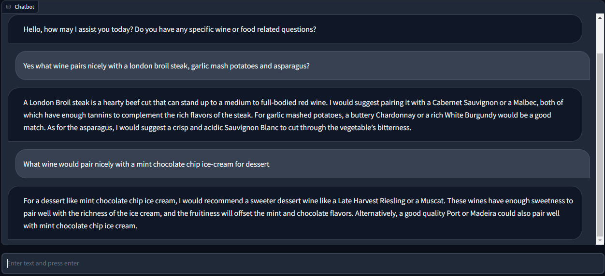

Wine Sommelier Bot using GPT 3.5 
Use python 3.7

1) pip install openai
2) Add openai api key to key.txt file
3) pip install gradio

Runs locally http://127.0.0.1:7860

Reference:
https://github.com/Sentdex/ChatGPT-API-Basics
https://www.youtube.com/watch?v=c-g6epk3fFE&t=879s

